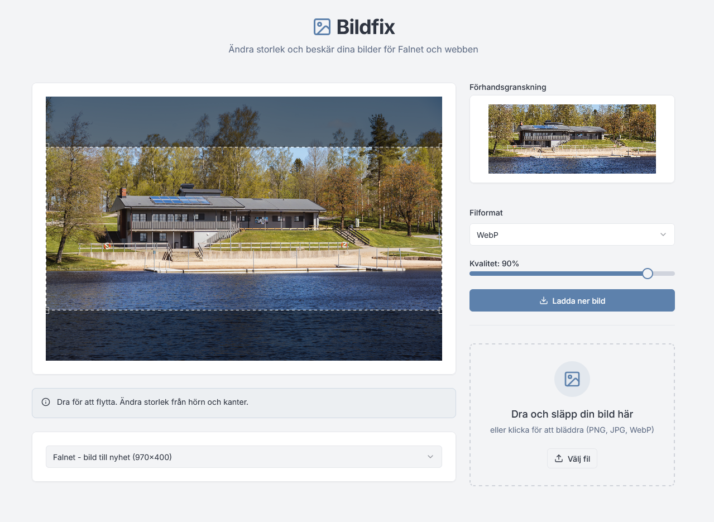

# Bildfix

Bildfix är ett webbaserat verktyg för att enkelt beskära och ändra storlek på bilder för användning på webb. Verktyget är byggt med Next.js och kör helt på klientsidan utan behov av server.



## Funktioner

- Dra och släpp eller välj bilder för uppladdning (stöd för PNG, JPG och WebP)
- Fördefinierade format för vanliga användningsfall:
  - Falnet - bild till nyhet (970×400)
  - Falnet - bild på sida (970×580)
  - Falkoping.se utfallande nyhetsbild (970×400)
  - Falkoping.se bild på sida (670×400)
- Interaktiv beskärning med realtidsförhandsvisning
- Valfritt filformat vid nedladdning (JPG, PNG eller WebP)
- Justerbar bildkvalitet för JPG och WebP
- Responsiv design som fungerar på alla enheter
- Varning när originalbilden är för liten för valt format

## Teknisk stack

- [Next.js](https://nextjs.org/) - React framework
- [Tailwind CSS](https://tailwindcss.com/) - Styling
- [shadcn/ui](https://ui.shadcn.com/) - UI-komponenter
- [react-image-crop](https://github.com/DominicTobias/react-image-crop) - Bildbehandling
- [react-dropzone](https://react-dropzone.js.org/) - Filuppladdning

## Utveckling

1. Klona repot

   ```bash
   git clone https://github.com/datalektiker/bildfix.git
   cd bildfix
   ```

2. Installera beroenden

   ```bash
   npm install
   ```

3. Starta utvecklingsservern

   ```bash
   npm run dev
   ```

4. Öppna [http://localhost:3001](http://localhost:3001) i din webbläsare

## Bygga för produktion

```bash
npm run build
```

Detta genererar en statisk version av appen i `out`-mappen som kan distribueras på valfri webbserver.
